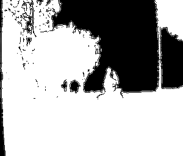
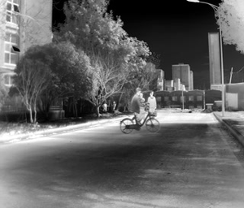
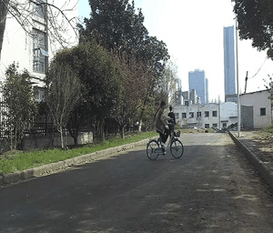

# Multi-Modal Visual Pattern Recognition Challenge <br>Track 3: Multi-Modal Action Recognition

<div align="center">
    
</div>

This is the official repository for the Multi-Modal Visual Pattern Recognition-_Track3 Multi-Modal Action Recognition_ (ICPR 2024). You can visit the challenge's official [website](https://prci-lab.github.io/mmvpr-workshop-icpr2024/) for more information, or you can directly participate in the challenge on [codalab](https://codalab.lisn.upsaclay.fr/competitions/19861).

## Overview
This track focuses on recognizing human actions from Multi-Modal data sources. The dataset for this track contains 2500 Multi-Modal videos (2000 for training and 500 for test) spanning across 20 action classes. You can find details of the dataset on this repo.

To participate, please fill out this online [Multi-Modal Visual Pattern Recognition Challenge Datasets Request Form](https://docs.google.com/forms/d/e/1FAIpQLSeJGZTYW-JS0-IJKnWgYGnE0EgdXnoL7Yi0xc-F9Z6XU1X4Zg/viewform).


**Note**: Top performers on the public ranking board will be invited to submit functional code for both training and inference for the problem. Test data must not be used for any kind of training (supervised or self-supervised). The data from the train split and any other dataset can be used for training, fine-tuning, or prompting.

## Details

### Example Videos

| Depth | Thermal-IR | RGB |
|:-----------:|:----------------:|:---------:|
|  |  |  |

### Categories

The dataset for this track contains 20 categories.

|Categories          |            |             |         |
|---------------------|---------------------|----------------------|------------------|
| switch light        | up the stairs       | pack backpack        | ride a bike      |
| turn around         | fold clothes        | hug somebody         | long jump        |
| move the chair      | open the umbrella   | orchestra conducting | rope skipping    |
| shake hands         | squat               | swivel               | tie shoes        |
| tie hair            | twist waist         | wear hat             | down the stairs  |

### Dataset Details

|         | Videos | Frames              | Resolution                                  | Duration | Format                                    |
|---------|--------|---------------------|---------------------------------------------|----------|-------------------------------------------|
| Train   | 2000 for each modality   | 32k+ for each modality | 640×360 (Depth)<br>320×256 (Thermal IR)<br>455×256 (RGB) | 2~13s    | png (Depth)<br>jpg (Thermal IR)<br>jpg (RGB) |
| Test    | 500 for each modality   | 8.3k+ for each modality | 640×360 (Depth)<br>320×256 (Thermal IR)<br>455×256 (RGB) | 2~13s    | png (Depth)<br>jpg (Thermal IR)<br>jpg (RGB) |

## Structure

```
Track3-Multi-Modal Action Recognition
├── /training_set/
│ ├── train_videofolder.txt
│ ├── /depth_data/
│ │ ├── /1/
│ │ │ ├── 000001.png
│ │ │ ├── 000002.png
│ │ │ ├── ... ...
│ │ │ ├── 000150.png
│ │ ├── ... ...
│ ├── /ir_data/
│ │ ├── /1/
│ │ │ ├── 000001.jpg
│ │ │ ├── 000002.jpg
│ │ │ ├── ... ...
│ │ │ ├── 000150.jpg
│ ├── /rgb_data/
│ │ ├── /1/
│ │ │ ├── 000001.jpg
│ │ │ ├── 000002.jpg
│ │ │ ├── ... ...
│ │ │ ├── 000150.jpg
├───── ... ...
└──/test_set/
  ├── test_videofolder.txt
  ├── /depth_data/
  │ ├── /1/
  │ │ ├── 000001.png
  │ │ ├── 000002.png
  │ │ ├── ... ...
  │ │ ├── 000150.png
  ├── /ir_data/
  │ ├── /1/
  │ │ ├── 000001.jpg
  │ │ ├── 000002.jpg
  │ │ ├── ... ...
  │ │ ├── 000150.jpg
  ├── /rgb_data/
  │ ├── /1/
  │ │ ├── 000001.jpg
  │ │ ├── 000002.jpg
  │ │ ├── ... ...
  │ │ ├── 000150.jpg
  └───
```
# Baseline
This code is based on the [TSM](https://github.com/mit-han-lab/temporal-shift-module). So you can follow the prerequisites of [TSM](https://github.com/mit-han-lab/temporal-shift-module). 
<br>We have modified the original version to accommodate multimodal tasks. You can also adjust it yourself.

## Training 

We provided several examples to train MM-TSM with this repo:

- To train on Multi-Modal Action Recognition Dataset, using ImageNet pre-training is usually better:

  ```bash
  python main.py mmvpr RTD \
       --arch resnet50 --num_segments 8 \
       --gd 20 --lr 0.01 --lr_steps 20 40 --epochs 50 \
       --batch-size 64 -j 16 --dropout 0.5 --consensus_type=avg --eval-freq=1 \
       --shift --shift_div=8 --shift_place=blockres --npb
  ```
  
## Results 
- To obtain the final results, you can generate the _submission.csv_ through _generate_submission.py_ like this:
  ```bash
  # efficient setting: center crop and 1 clip
  python generate_submission.py mmvpr \
      --weights=pretrained/TSM_mmvpr_RTD_resnet50_shift8_blockres_avg_segment8_e45.pth \
      --test_segments=8 --batch_size=1 --test_crops=1
  ```
  In submission.csv, each row should be formatted as '<strong>[video id], [predicted Top-5 classes]</strong>'. After obtaining the submission.csv file, you can directly submit it to Codalab for evaluation.


*If you have any questions, please email us at linze.cv@gmail.com.*
